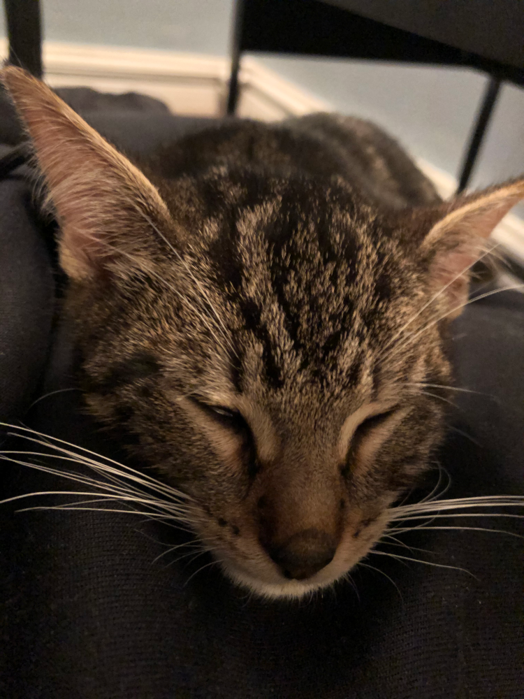

# pixmap-ops

Image manipulation demos based on the PPM image format.

TODO: Add a representative image for your project here

## How to build

*Windows*

Open git bash to the directory containing this repository.

```
pixmap-ops $ mkdir build
pixmap-ops $ cd build
pixmap-ops/build $ cmake -G "Visual Studio 16 2019" ..
pixmap-ops/build $ start Pixmap-Ops.sln
```

Your solution file should contain two projects: `pixmap_art` and `pixmap_test`.
To run from the git bash command shell, 

```
pixmap-ops/build $ ../bin/Debug/pixmap_test
pixmap-ops/build $ ../bin/Debug/pixmap_art
```

*macOS*

Open terminal to the directory containing this repository.

```
pixmap-ops $ mkdir build
pixmap-ops $ cd build
pixmap-ops/build $ cmake ..
pixmap-ops/build $ make
```

To run each program from build, you would type

```
pixmap-ops/build $ ../bin/pixmap_test
pixmap-ops/build $ ../bin/pixmap_art
```

## Image operators

### Required operators

*Resize*

Return a copy of this image resized to the given width and height (Example: resize a 750 \* 1000 image to 1000 \* 750). 

Original image (Havercat, photo taken on Oct.16, 2019)            |  Resized image
:-------------------------:|:-------------------------:
  |  


## Results

TODO: Show artworks using your class

