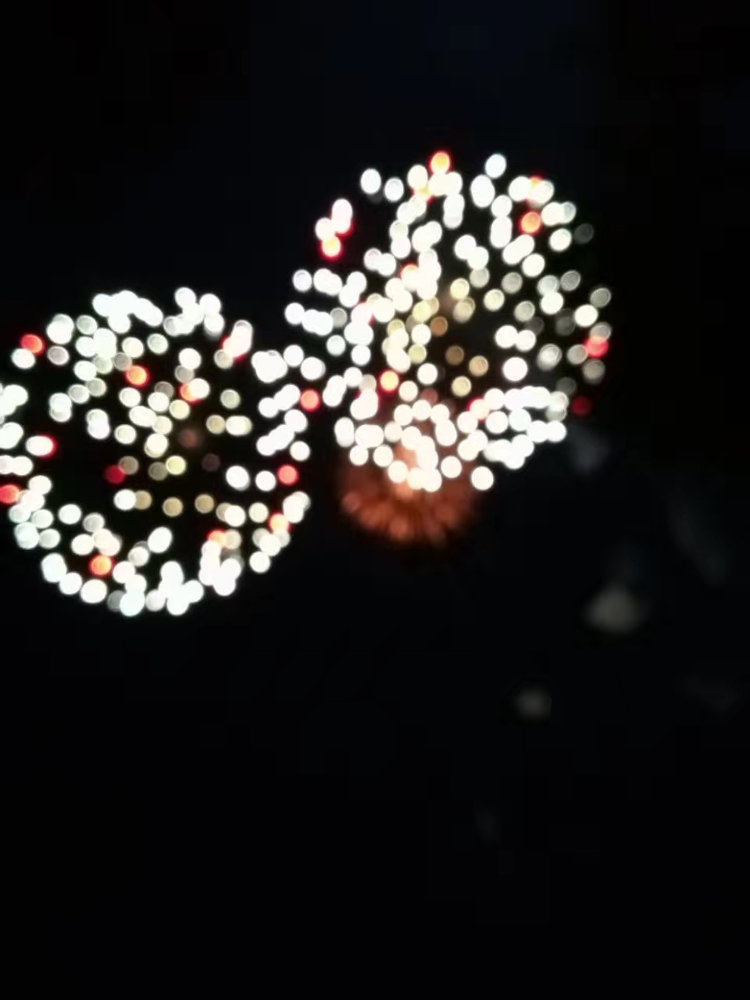
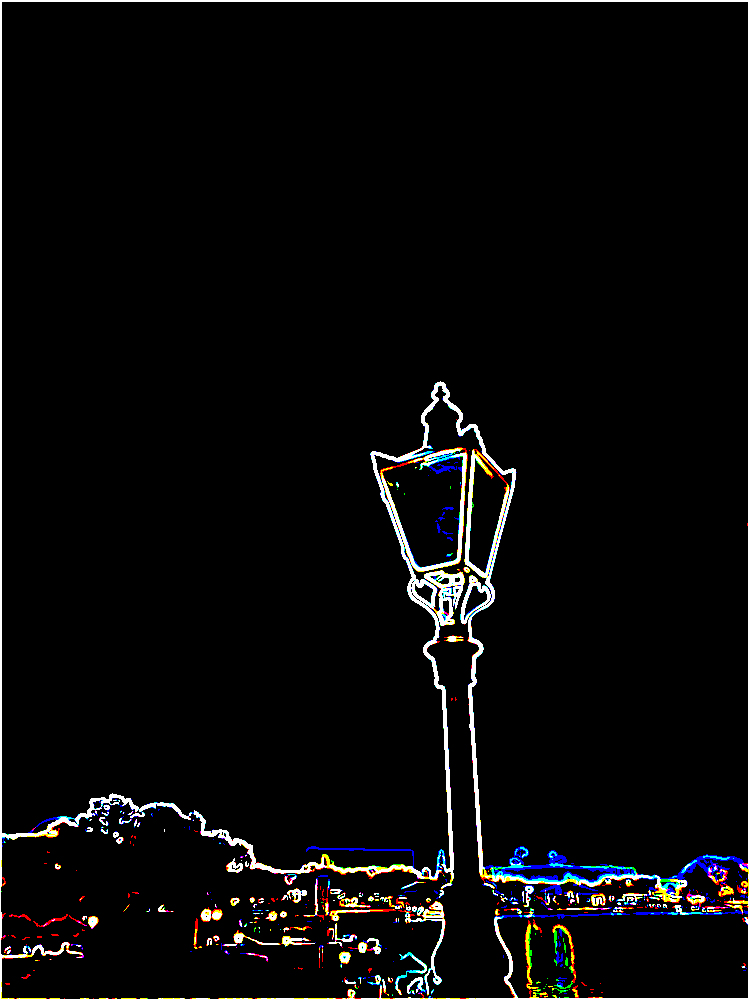

# pixmap-ops

Image manipulation demos based on the PPM image format.

TODO: Add a representative image for your project here

## How to build

*Windows*

Open git bash to the directory containing this repository.

```
pixmap-ops $ mkdir build
pixmap-ops $ cd build
pixmap-ops/build $ cmake -G "Visual Studio 16 2019" ..
pixmap-ops/build $ start Pixmap-Ops.sln
```

Your solution file should contain two projects: `pixmap_art` and `pixmap_test`.
To run from the git bash command shell, 

```
pixmap-ops/build $ ../bin/Debug/pixmap_test
pixmap-ops/build $ ../bin/Debug/pixmap_art
```

*macOS*

Open terminal to the directory containing this repository.

```
pixmap-ops $ mkdir build
pixmap-ops $ cd build
pixmap-ops/build $ cmake ..
pixmap-ops/build $ make
```

To run each program from build, you would type

```
pixmap-ops/build $ ../bin/pixmap_test
pixmap-ops/build $ ../bin/pixmap_art
```

## Image operators

### Required operators

*Resize*

Return a copy of this image resized to the given width and height. 

Original image (750 \* 1000; Havercat, photo taken in 2019)            |  Resized image (600 \* 650)
:-------------------------:|:-------------------------:
  |  


*Horizontal* *Flip*

Return a copy of this image flipped around the horizontal midline.

Original image (Fireworks at Iowa, photo taken on National Day, 2017)            |  Flipped image
:-------------------------:|:-------------------------:
  |  

*Subimage*

Return a sub-image having the given top, left coordinate and (width, height).

Original image (Shanghai evening, photo taken in 2017)            |  Shanghai Metro icon ((210, 110) with (width, height) = (120, 120))
:-------------------------:|:-------------------------:
  |  


*Gamma* *Correction*

Return a copy of this image with the given gamma correction applied to it.

Original image (Haverford evening, photo taken in 2019)            |  Corrected image (gamma = 0.6)
:-------------------------:|:-------------------------:
  |  


*Grayscale*

Return a copy of this image converged to grayscale.

Original image (Haverford spring, photo taken in 2019)            |  Gray image
:-------------------------:|:-------------------------:
  |  


*Alpha* *Blend*

Apply the canonical linear function to the pixels in this image and another image. Assume that the two images have the same size

Original image          |  Blended image (alpha = 0.2)
:-------------------------:|:-------------------------:
  |  


*Replace*
Replace the portion starting at (row, col) with the given image. Clamps the image if it doesn't fit on this image.

Original image          |  Result image (replaced after resizing and alpha blend)
:-------------------------:|:-------------------------:
  |  


### Added operators

*Lightest*

Combine a copy of this image and a given image so that every pixel is taken to be the brightest. Assume that the two images are the same size.

Original image (Orlando Disneyland, photo taken in 2019)         |  Result image
:-------------------------:|:-------------------------:
  |  

*Darkest*

Combine a copy of this image and a given image so that every pixel is taken to be the darkest. Assume that the two images are the same size.

Original image        |  Result image
:-------------------------:|:-------------------------:
  |  

*Swirlcolor*

Return a copy of this image whose colors are rotated.

Original image (FRC robot, photo taken in 2017)        |  Result image
:-------------------------:|:-------------------------:
  |  

*Invert*

Return a copy of this image whose colors are inverted (with a specified extent, alpha).

Original image        |  Result image (alpha = 1)
:-------------------------:|:-------------------------:
  |  

*Sobel*

Given a threshold, return a copy of this image that detects the edges (with a specified color of edge (dark/bright)).

Original image        |  Result image (threshold = 120, edge color = bright)
:-------------------------:|:-------------------------:
  |  

*Gaussian* *Blur*

Return a copy of this image that is applied with 5 \* 5 Gaussian smoothing (zoom in to see the difference).

Original image        |  Result image
:-------------------------:|:-------------------------:
  |  

*Sharpen*

Return a copy of this image that is sharpened (zoom in to see the difference).

Original image (Yin, drawn in summer, 2020)       |  Result image
:-------------------------:|:-------------------------:
  |  


## More selected Artworks

*Yin on blackboard*

The original image is processed as if it is drawn on a blackboard. Processing: gamma correction with gamma = 0.6 followed by an invertion with alpha = 1.


*Cyberpunk Disneyland*

The original image is proccessed in a cyberpunk style. Processing: gamma correction with gamma = 2.0; gaussian blur; sobel with threshold = 80 and edge color = bright.



*Comic Robot*

The original image is proccessed in a comic style. Processing: gamma correction with gamma = 2.0; grayscale; gaussian blur; sobel with threshold = 23 and edge color = dark.


